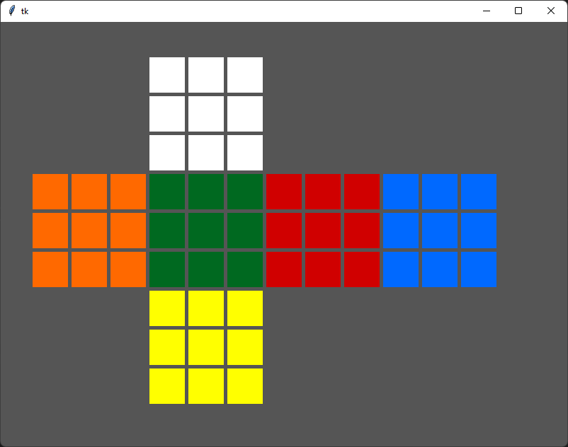
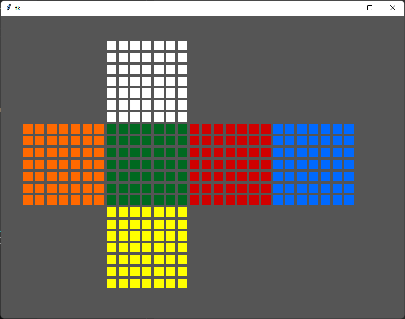

# Visual Cube

My intent with this project was to implement a visualization for twisty puzzles.
I currently have a working implementation for NxN puzzles and would like to
branch out to other puzzles like square-1, clock, megaminx, ect. . I'm currently
reworking the `move()` method to be more abstract as it currently requires large
concrete implementations for each cube size which more or less redundant code.

# 3x3 example
solved state

a t-perm applied with white on top and green as the front

# 7x7 example

# getting started
install the latest version of python3.

run `pip install -r requirements.txt` while in the git repo.

The entry point is `visualCube.py`*.

*This app currently takes input from the user through stdin.
# extra
I've included a small vscode settings file containing some todo highlighting
rules that I personally use. They may appear through my source code so I thought
it would be helpful to include them